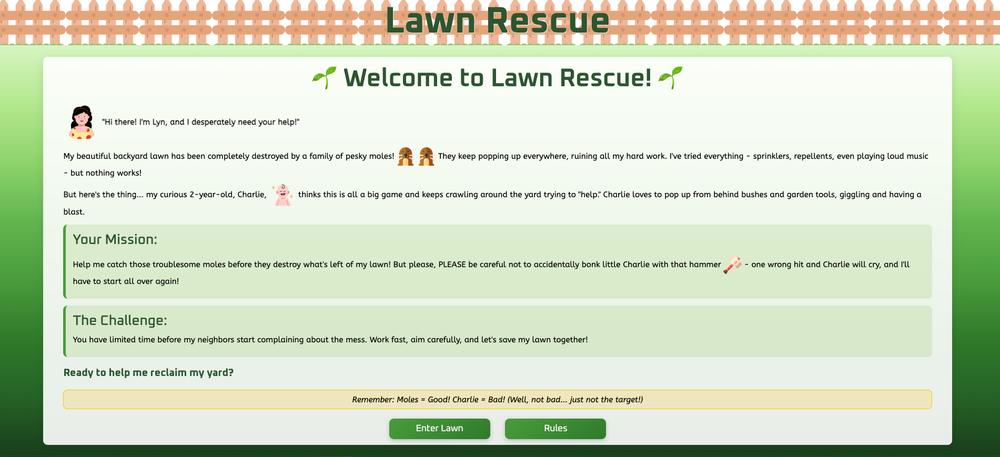
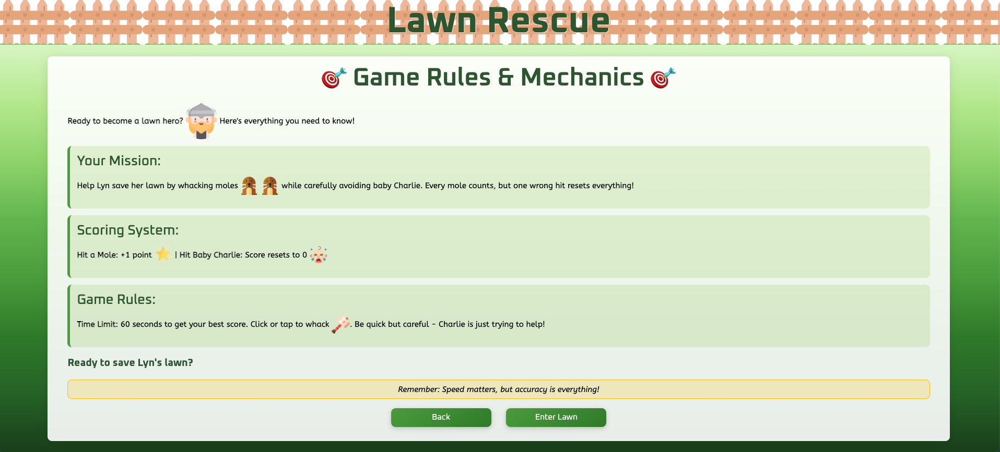
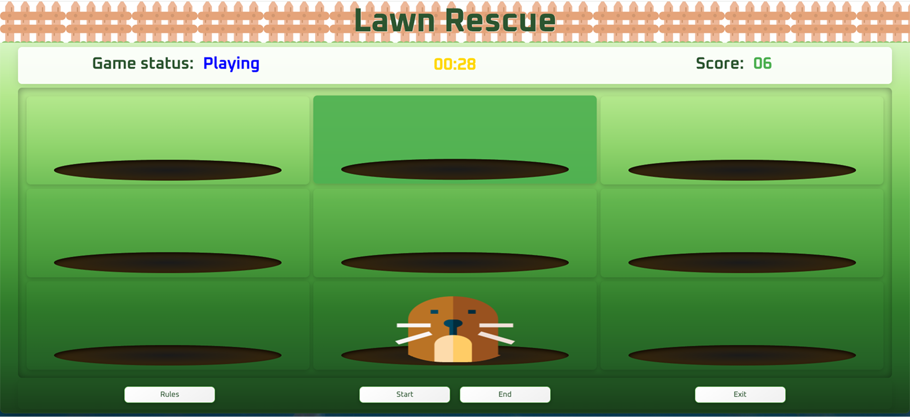
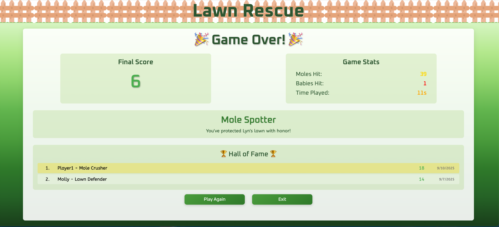

## Project Title

Lawn Rescue

## Project Description

Lawn Rescue is a fun interactive game for kids and adults alike. The goal is to hit as many moles possible within the time limit while avoiding the baby. The ability to save score in the browser's local storage is implemented but not necessary.

This projects was created using Vite as a development environmen and installation of npm package sound player, Howler.

## Technologies and Dependencies Used

Used HTML, CSS, JavaScript, Vite, Howler

## How to Install and Run

Clicking the GitHub pages link automatically starts up the project.

## How to Play

The player is welcomed by the game's storyboard.

.

<!-- . -->

Detailed mechanics for the game is available in the 'Rules' page.
.

Entering lawn is where the fun begins but ensuring that proper volume is set on the device is a MUST. The game starts by clicking 'Start'. The player can end the game before the one minute ends; however, doing this will not allow saving the game progress (score).
.

Whether the player finishes the game or viluntarily quits in advance, the option to view some game statistics such as score and locally saved score if there's any.
.

## Credits/Acknowledgments

Pixabay and Flaticon for images and sounds used in the game.

## License

IT-Utvikler AMO/Kodehode
